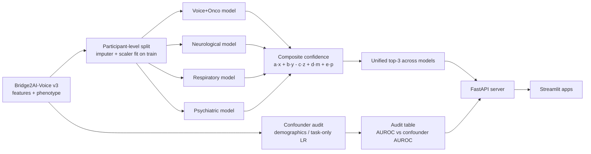

# TC-DANN: Confounder-Audited Voice Disease Screening

Task-conditioned, domain-adversarial neural networks that screen for 20 voice-linked diseases on Bridge2AI-Voice v3.0.0, built after an audit showed that demographics and recording protocol alone can "predict" disease.

 

> Research code only. Not a medical device, not clinically validated. No data, features, or trained weights are distributed in this repository.

## What it does

- **Confounder audit first.** Measures how well demographics alone, or the recording-task histogram alone, can "predict" each disease label, exposing shortcuts before any acoustic model is trained (`audit/confounder_analysis.py`).
- **Four domain-separated models** (Voice+Oncological, Neurological, Respiratory, Psychiatric) with FiLM task conditioning on every encoder layer and a gradient-reversal site adversary that pushes the 128-d representation to be site-invariant (`tcdann/run_tc_dann.py`).
- **Audit as a gate.** Every disease head is reported against a task-only confounder baseline on the held-out split, and a head only passes if its acoustic AUROC clears the confounder AUROC by a margin.
- **Transparent confidence score** per prediction: `conf = a·x + b·y - c·z + d·m + e·p` (subgroup cosine similarity, head probability, runner-up penalty, demographic prior, confounder robustness), with the demographic term forced to 0 for psychiatric heads.
- **External check on the Saarbrücken Voice Database (SVD, German):** the same confounder audit is rerun on held-out SVD patients (`svd/run_tc_dann_svd.py`).
- **Serving:** FastAPI inference server (raw audio or features in, unified cross-model top-3 plus audit flags out) and Streamlit front ends, including a 5-stage screening app with a multi-agent clinical-reasoning layer (Claude, Gemini, Tavily, Milvus RAG).

## Architecture



Each domain model takes per-modality inputs (MFCC, mel, spectrogram, pitch, loudness, periodicity, EMA, static features; PPG dropped after it showed no signal in ablation), passes them through an FC 512 to 256 to 128 encoder with FiLM conditioning on the recording task, and feeds a gradient-reversal layer into a site classifier so the encoder cannot rely on recording site. The four models were split apart after an ablation showed that physical-voice modalities hurt psychiatric heads inside a single shared model. Predictions from all four models are pooled and re-ranked by the confidence score. See [docs/TCDANN_DESIGN.md](docs/TCDANN_DESIGN.md) for the full design rationale.

## Quickstart

```bash
git clone https://github.com/DevSoVague/tc-dann-voice-screening.git
cd tc-dann-voice-screening
python3 -m venv .venv && source .venv/bin/activate
pip install -r requirements.txt
export B2AI_DATA_ROOT=/path/to/b2ai-voice/3.0.0
```

Configuration is read from environment variables only:

- Data and audit: `B2AI_DATA_ROOT`, `AUDIT_OUT_DIR`, `PREDICTIONS_DIR`, `SVD_OUT_ROOT`, `CONFOUNDER_PRIORS_JSON` (optional)
- Serving: `TC_DANN_BUNDLE_DIR`, `SESSIONS_DIR`, `TC_DANN_API`, `VOXCLIN_API`
- Agentic app (optional): `ANTHROPIC_API_KEY`, `GEMINI_API_KEY`, `TAVILY_API_KEY`, `MILVUS_URI`, `MILVUS_TOKEN`, `MILVUS_COLLECTION`

Run the confounder audit, then train and evaluate TC-DANN:

```bash
python audit/confounder_analysis.py                      # writes outputs/audit/
cd tcdann
python run_tc_dann.py --epochs 5 --smoke_test            # quick check
python run_tc_dann.py --epochs 40                        # full run, writes $B2AI_DATA_ROOT/tc_dann_results/
python explain_tc_dann.py --bundle $B2AI_DATA_ROOT/tc_dann_results/psychiatric_model_best.joblib --stem psychiatric
```

Serve the trained bundles:

```bash
cd tcdann
TC_DANN_BUNDLE_DIR=$B2AI_DATA_ROOT/tc_dann_results uvicorn tc_dann_api_server:app --port 8000
streamlit run tc_dann_app.py                             # TC-DANN front end
python tc_dann_predict.py recording.wav --task prolonged-vowel --bundle_dir $B2AI_DATA_ROOT/tc_dann_results
```

`voxclinbench_app.py` is the larger 5-stage screening app with the multi-agent chat and RAG pages. It needs `ANTHROPIC_API_KEY`, `GEMINI_API_KEY`, `TAVILY_API_KEY` and a running Milvus (`MILVUS_URI`), read from the environment only. It was originally built against a separate model API; it calls `/health` and `/predict` at `VOXCLIN_API` and falls back to mock predictions when no API is reachable.

External validation on SVD:

```bash
python svd/svd_preprocess.py --svd_root /path/to/svd --out_root /path/to/svd_out
SVD_OUT_ROOT=/path/to/svd_out python svd/run_tc_dann_svd.py --epochs 40
```

## Data access

This repository contains **code only**. No recordings, features, phenotype files, splits, predictions, or data-derived weights are included, and none should ever be committed (see `.gitignore`).

1. **Bridge2AI-Voice v3.0.0** is a credentialed dataset on PhysioNet. Complete PhysioNet credentialing (including the required human-subjects training), then request access and sign the Bridge2AI-Voice Data Use Agreement on the dataset page at <https://physionet.org/>.
2. Download it to a local folder you control and point the code at it:
   ```bash
   export B2AI_DATA_ROOT=/path/to/b2ai-voice/3.0.0   # contains features/ and phenotype/
   ```
3. **Saarbrücken Voice Database (SVD)** is used for external validation only. Obtain it from its maintainers under their terms; it is not redistributable. Pass its location with `--svd_root`.

Trained bundles (`*_model_best.joblib`, `*.pt`) are derived from the protected data and are not distributed; train your own after obtaining access.

## Project structure

```
tc-dann-voice-screening/
├── tcdann/                 final quad-model TC-DANN + serving
│   ├── run_tc_dann.py        training, evaluation, audit table, joblib bundles
│   ├── tc_dann_predict.py    CLI / library inference
│   ├── explain_tc_dann.py    SHAP attributions per disease and task
│   ├── tc_dann_api_server.py FastAPI server
│   ├── tc_dann_app.py        Streamlit front end for TC-DANN
│   ├── voxclinbench_app.py   5-stage screening app + multi-agent chat + RAG pages
│   ├── indexer.py            Milvus PDF indexer (LangGraph)
│   ├── audio_preprocessing.py, confounder_baseline.py, extract_pure_labels.py
├── audit/                  confounder and demographic-stratification audit
├── svd/                    SVD preprocessing + external-validation runner
├── legacy_gcp/             earlier single-model TC-DANN (5-seed ensemble, conformal abstain, GKE)
├── docs/                   design notes, legacy README, GCP deployment guide
└── requirements.txt
```

`legacy_gcp/` is an earlier variant (one transformer-fusion model, adversaries on site/age/sex, group temperature scaling and split-conformal abstention) containerized for parallel ensemble training on GKE H100 nodes; see [docs/LEGACY_SINGLE_MODEL.md](docs/LEGACY_SINGLE_MODEL.md) and [docs/GCP_DEPLOYMENT.md](docs/GCP_DEPLOYMENT.md). The final model in `tcdann/` replaced it.

## Credits

Built by **Devavrath Sandeep** at Carnegie Mellon University, Spring 2026: EDA, the confounder and shortcut audit, modality ablation and explainability analysis, the TC-DANN model and confidence score, SVD external validation, and the inference API and front-end apps.

- `audit/demographic_stratification.py` consumes patient-level predictions produced by separate benchmark models; those models and their prediction files are not included here.
- Data: Bridge2AI-Voice consortium (PhysioNet) and the Saarbrücken Voice Database. Gradient reversal follows Ganin and Lempitsky (2015). MARVEL (Piao et al., 2025) was used as a comparator.

## License

MIT, see [LICENSE](LICENSE). The license covers the code only, not any dataset.
