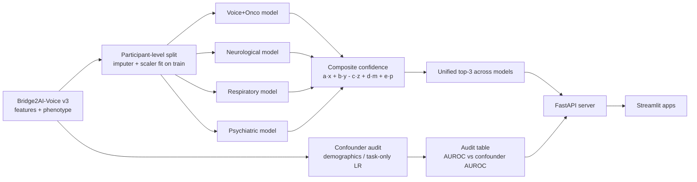

# TC-DANN: Confounder-Audited Voice Disease Screening

Task-conditioned, domain-adversarial neural networks that screen for 20 voice-linked diseases on Bridge2AI-Voice v3.0.0, built after an audit showed that demographics and recording protocol alone can "predict" disease.

 

> Research code only. Not a medical device, not clinically validated. The full pipeline (audit, training, inference, API, apps, agent layer, deploy files) is included; no data, features, or trained weights are distributed.

## What it does

- **Confounder audit first.** Measures how well demographics alone, or the recording-task histogram alone, can "predict" each disease label, exposing shortcuts before any acoustic model is trained (`audit/confounder_analysis.py`).
- **Four domain-separated models** (Voice+Oncological, Neurological, Respiratory, Psychiatric) with FiLM task conditioning on every encoder layer and a gradient-reversal site adversary that pushes the 128-d representation to be site-invariant (`tcdann/run_tc_dann.py`).
- **Audit as a gate.** Every disease head is reported against a task-only confounder baseline on the held-out split, and a head only passes if its acoustic AUROC clears the confounder AUROC by a margin.
- **Transparent confidence score** per prediction: `conf = a·x + b·y - c·z + d·m + e·p` (subgroup cosine similarity, head probability, runner-up penalty, demographic prior, confounder robustness), with the demographic term forced to 0 for psychiatric heads.
- **External check on the Saarbrücken Voice Database (SVD, German):** the same confounder audit is rerun on held-out SVD patients (`svd/run_tc_dann_svd.py`).
- **Serving:** FastAPI inference server (raw audio or features in, unified cross-model top-3 plus audit flags out) and Streamlit front ends, including a 5-stage screening app with a multi-agent clinical-reasoning layer (Claude, Gemini, Tavily, Milvus RAG).

## Architecture



Each domain model takes per-modality inputs (MFCC, mel, spectrogram, pitch, loudness, periodicity, EMA, static features; PPG dropped after it showed no signal in ablation), passes them through an FC 512 to 256 to 128 encoder with FiLM conditioning on the recording task, and feeds a gradient-reversal layer into a site classifier so the encoder cannot rely on recording site. The four models were split apart after an ablation showed that physical-voice modalities hurt psychiatric heads inside a single shared model. Predictions from all four models are pooled and re-ranked by the confidence score. See [docs/TCDANN_DESIGN.md](docs/TCDANN_DESIGN.md) for the full design rationale.

## Quickstart (end to end)

The pipeline is: confounder audit, then train the four bundles, then start the API, then start a front end.

```bash
git clone https://github.com/DevSoVague/tc-dann-voice-screening.git
cd tc-dann-voice-screening
python3 -m venv .venv && source .venv/bin/activate
pip install -r requirements.txt            # or requirements-serve.txt for API + app only
```

### 1. Train (or bring your own bundles)

Trained weights are not distributed: they were trained on Bridge2AI-Voice under the PhysioNet data use agreement. Credentialed PhysioNet users can train them with the included script (or contact the author):

```bash
export B2AI_DATA_ROOT=/path/to/b2ai-voice/3.0.0
python audit/confounder_analysis.py                                    # confounder audit, writes outputs/audit/
python tcdann/run_tc_dann.py --data_root "$B2AI_DATA_ROOT" --epochs 40 --out_dir models
# quick check first: add --smoke_test --epochs 5
```

This writes `models/voice_onco_model_best.joblib`, `models/neurological_model_best.joblib`, `models/respiratory_model_best.joblib` and `models/psychiatric_model_best.joblib` (plus optional `*_model_checkpoint.pt`). `scripts/train.sh` runs both steps. See [models/README.md](models/README.md) for the exact file contract. To keep bundles elsewhere, point `TC_DANN_BUNDLE_DIR` at that folder.

Explain a trained model (SHAP per disease and recording task):

```bash
python tcdann/explain_tc_dann.py --bundle models/psychiatric_model_best.joblib --stem psychiatric
```

### 2. Start the API

```bash
scripts/serve_api.sh                       # uvicorn on :8000, reads $TC_DANN_BUNDLE_DIR (default models/)
curl localhost:8000/health
```

Endpoints: `GET /health`, `GET /diseases`, `POST /predict` (audio file), `POST /predict_features` (feature JSON), `POST /record` (base64 browser audio), `GET /sessions`, `GET /sessions/{id}`. Without bundles the server still starts: `/health` reports `"status": "no_models"` and the prediction endpoints return HTTP 503 with instructions instead of a stack trace.

CLI inference without the server:

```bash
python tcdann/tc_dann_predict.py recording.wav --task prolonged-vowel   # --bundle_dir to override
```

### 3. Start a front end

```bash
scripts/run_app.sh                         # TC-DANN Streamlit app on :8501 (TC_DANN_API, default http://localhost:8000)
scripts/run_app.sh voxclin                 # 5-stage VoxClinBench app with multi-agent chat + RAG pages
```

The TC-DANN app shows model status pills from `/health` and a clear warning when no bundles are loaded. `voxclinbench_app.py` was originally built against a separate model API; it calls `/health` and `/predict` at `VOXCLIN_API` and falls back to clearly labelled mock predictions when no compatible API is reachable.

### 4. Agentic clinical-reasoning layer (optional)

- `tcdann/indexer.py`: Milvus PDF indexer with a LangGraph retrieve, generate, reflect, revise loop. Index a folder of papers per category:
  ```bash
  export MILVUS_URI=http://localhost:19530 GEMINI_API_KEY=...
  python scripts/index_papers.py --pdf_dir papers/pharma --paper_type Pharmacology
  ```
- `agents/langflow/clinical_reasoning_multiagent.json`: the 41-node Langflow flow (Pharma, Guidelines, Rehab and Comorbidity ReAct agents, each with Tavily web search and a Milvus RAG tool filtered by `paper_type`, feeding a master synthesis agent). Import it in Langflow, then fill the Anthropic / Vertex AI / Tavily credentials in Langflow's own settings or global variables; no keys are stored in the file. Its RAG tools read the collection `papers_rag_interactive` by default, so either index into that name (`MILVUS_COLLECTION=papers_rag_interactive`) or change the tool input.

### Docker

```bash
docker compose -f deploy/docker-compose.yml up --build    # API on :8000, app on :8501, mounts ./models read-only
```

`deploy/gke/` holds the Dockerfile, PVC and indexed-Job manifests for the legacy ensemble training on GKE (see [docs/GCP_DEPLOYMENT.md](docs/GCP_DEPLOYMENT.md)).

### External validation on SVD

```bash
python svd/svd_preprocess.py --svd_root /path/to/svd --out_root /path/to/svd_out
SVD_OUT_ROOT=/path/to/svd_out python svd/run_tc_dann_svd.py --epochs 40
```

### Environment variables

Configuration is read from environment variables only (no config files with secrets):

- Data and audit: `B2AI_DATA_ROOT`, `AUDIT_OUT_DIR`, `PREDICTIONS_DIR`, `SVD_OUT_ROOT`, `CONFOUNDER_PRIORS_JSON` (optional)
- Serving: `TC_DANN_BUNDLE_DIR` (default `models/`), `SESSIONS_DIR`, `TC_DANN_API`, `VOXCLIN_API`, `HOST`, `PORT`
- Agentic layer (optional): `ANTHROPIC_API_KEY`, `GEMINI_API_KEY`, `TAVILY_API_KEY`, `MILVUS_URI`, `MILVUS_TOKEN`, `MILVUS_COLLECTION`, `EMBED_DEVICE`, `TRANSLATOR_URL`

## Data access

This repository contains **code only**. No recordings, features, phenotype files, splits, predictions, or trained weights are included, and none should ever be committed (see `.gitignore`).

1. **Bridge2AI-Voice v3.0.0** is a credentialed dataset on PhysioNet. Complete PhysioNet credentialing (including the required human-subjects training), then request access and sign the Bridge2AI-Voice Data Use Agreement on the dataset page at <https://physionet.org/>.
2. Download it to a local folder you control and point the code at it:
   ```bash
   export B2AI_DATA_ROOT=/path/to/b2ai-voice/3.0.0   # contains features/ and phenotype/
   ```
3. **Saarbrücken Voice Database (SVD)** is used for external validation only. Obtain it from its maintainers under their terms; it is not redistributable. Pass its location with `--svd_root`.

Trained bundles (`*_model_best.joblib`, `*.pt`) are derived from the protected data (each bundle also stores training-set embeddings for the subgroup-similarity term), so they are not distributed. Train your own with the command above after obtaining access, or contact the author.

## Project structure

```
tc-dann-voice-screening/
├── tcdann/                    final quad-model TC-DANN + serving
│   ├── run_tc_dann.py           training, evaluation, audit table, joblib bundles (--out_dir)
│   ├── tc_dann_predict.py       CLI / library inference
│   ├── explain_tc_dann.py       SHAP attributions per disease and task
│   ├── tc_dann_api_server.py    FastAPI server
│   ├── tc_dann_app.py           Streamlit front end for TC-DANN
│   ├── voxclinbench_app.py      5-stage screening app + multi-agent chat + RAG pages
│   ├── indexer.py               Milvus PDF indexer (LangGraph)
│   └── audio_preprocessing.py, confounder_baseline.py, extract_pure_labels.py
├── agents/langflow/           41-node multi-agent clinical-reasoning flow (no keys)
├── models/                    drop trained bundles here (README only in git)
├── scripts/                   train.sh, serve_api.sh, run_app.sh, index_papers.py
├── deploy/                    Dockerfile, docker-compose.yml, gke/ (legacy training jobs)
├── audit/                     confounder and demographic-stratification audit
├── svd/                       SVD preprocessing + external-validation runner
├── legacy_gcp/                earlier single-model TC-DANN (5-seed ensemble, conformal abstain, GKE)
├── docs/                      design notes, legacy README, GCP deployment guide
├── requirements.txt           everything (training, serving, agent layer, legacy)
└── requirements-serve.txt     API + CLI + Streamlit only
```

`legacy_gcp/` is an earlier variant (one transformer-fusion model, adversaries on site/age/sex, group temperature scaling and split-conformal abstention) containerized for parallel ensemble training on GKE H100 nodes; see [docs/LEGACY_SINGLE_MODEL.md](docs/LEGACY_SINGLE_MODEL.md) and [docs/GCP_DEPLOYMENT.md](docs/GCP_DEPLOYMENT.md). The final model in `tcdann/` replaced it.

## Credits

Built by **Devavrath Sandeep** at Carnegie Mellon University, Spring 2026: EDA, the confounder and shortcut audit, modality ablation and explainability analysis, the TC-DANN model and confidence score, SVD external validation, and the inference API and front-end apps.

- `audit/demographic_stratification.py` consumes patient-level predictions produced by separate benchmark models; those models and their prediction files are not included here.
- Data: Bridge2AI-Voice consortium (PhysioNet) and the Saarbrücken Voice Database. Gradient reversal follows Ganin and Lempitsky (2015). MARVEL (Piao et al., 2025) was used as a comparator.

## License

MIT, see [LICENSE](LICENSE). The license covers the code only, not any dataset.
